# Example of running app demo 
This file contains logs and photos of demo execution.

1. Open Substrate app on Ledger

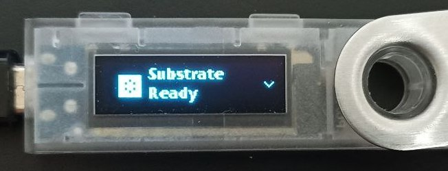

2. Run demo script - `yarn build && yarn start`

Initial logs:
```bash
Getting information from Ledger
App version: {
    "return_code": 36864,
    "error_message": "No errors",
    "test_mode": false,
    "major": 0,
    "minor": 1,
    "patch": 0,
    "deviceLocked": false,
    "target_id": "31100004"
}
Ledger account: {
    "pubKey": "d8a1f451162e6163488001efd01ecc0f9db7494834664b34d0fd225d67f0b72d",
    "address": "15u3TJt3hc2oevVZi6YToyjdaymttFscQEoQNLn5CgLRvNtL",
    "return_code": 36864,
    "error_message": "No errors"
}
```
## Sign tx on Equilibrium Parachain

```bash
Sign transaction on Equilibrium

Signer ss58 address: cg817PN4M6ZkNJ7Epx8QyqxR7Cb3JxYaZrEHyqSZQMcFXhzJy
Tx hash: 0x57e11ae24382d340e5195def4ff8c57da3c9f1645e61225870e9c713c6a7220d. 
  Check it on Ledger!
```
Check tx hash and Genesis on Ledger

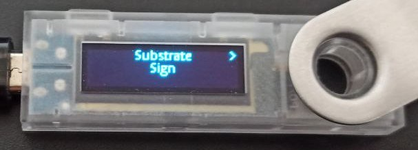

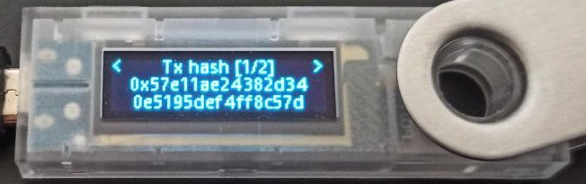

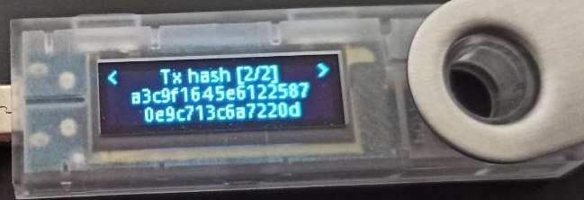

Equilibrium genesis hash added to list of already known chains, so app detected it and print chain name instead of genesis hash:

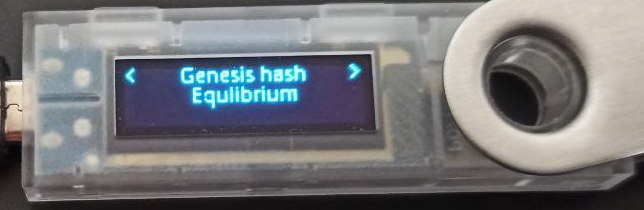

Approve tx on Ledger and back to console
```bash
Ledger response: {
    "return_code": 36864,
    "error_message": "No errors",
    "signature": "00cc82b71a16f1d41dc5c0d390e606762d2a9a6f0bdcaf66e59127a1c1917958dc403882a88a5d4ff5429b08b700a8da947f9d2e25270f23f960b222a4998d8707"
}
Signature is valid: true

Signed tx as bytes: 0x85028400d8a1f451162e6163488001efd01ecc0f9db7494834664b34d0fd225d67f0b72d00cc82b71a16f1d41dc5c0d390e606762d2a9a6f0bdcaf66e59127a1c1917958dc403882a88a5d4ff5429b08b700a8da947f9d2e25270f23f960b222a4998d8707520014000f0071650000000000004c388c1b04512ee6dd3afd3355fe0498f55c57773d1f4862bdf6aa27d12e387f00ca9a3b000000000000000000000000
Signed tx as json: {
    "isSigned": true,
    "method": {
        "args": {
            "asset": "25,969",
            "to": "cg4q1NRDwhj1ocFmfnJubbSxekchEdDXBc95KCQxHdzfVcBtL",
            "value": "1,000,000,000"
        },
        "method": "transfer",
        "section": "eqBalances"
    },
    "era": {
        "MortalEra": {
            "period": "8",
            "phase": "5"
        }
    },
    "nonce": "5",
    "signature": "0xcc82b71a16f1d41dc5c0d390e606762d2a9a6f0bdcaf66e59127a1c1917958dc403882a88a5d4ff5429b08b700a8da947f9d2e25270f23f960b222a4998d8707",
    "signer": {
      "Id": "cg817PN4M6ZkNJ7Epx8QyqxR7Cb3JxYaZrEHyqSZQMcFXhzJy"
    },
    "tip": "0"
}

Send signed tx to chain
Submitted tx hash: 0x7ca2d7464003d7f561b29411c286c831607ad9d98f190329b408a629f91be99e
Subscan link: https://equilibrium.subscan.io/extrinsic/0x7ca2d7464003d7f561b29411c286c831607ad9d98f190329b408a629f91be99e (please wait 1 minute to processing)
```
[Subscan](https://equilibrium.subscan.io/extrinsic/0x7ca2d7464003d7f561b29411c286c831607ad9d98f190329b408a629f91be99e)

## Sign tx on Bifrost
```bash
Sign transaction on Bifrost (Kusama)

Signer ss58 address: gd11G8U1MHAbGvM9Hpc5PLBTtdfDMejXt8C4SdsyouMcDHs
Tx hash: 0x5e26ebc1051e9bba7c184b09181936a8562ebc860014100422a2882dea634e4e.
  Check it on Ledger!
```
Check tx hash and Genesis on Ledger
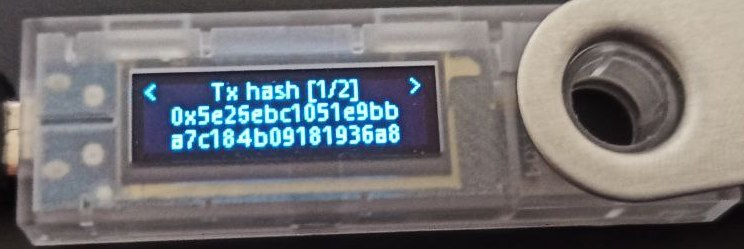

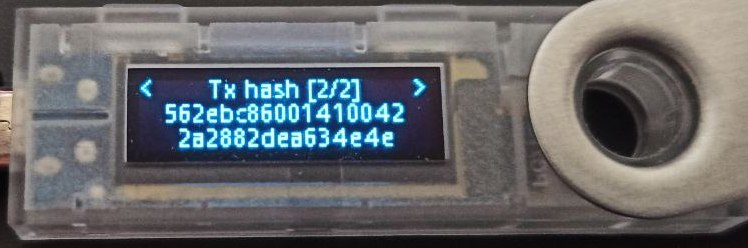

Bifrost (Kusama) genesis hash added to list of already known chains, so app detected it and print chain name instead of genesis hash:

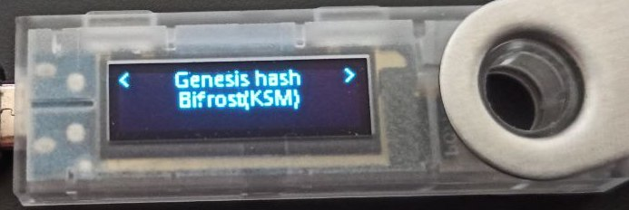

Approve tx on Ledger and back to console

```bash
Ledger response: {
    "return_code": 36864,
    "error_message": "No errors",
    "signature": "00af621995b4bbf91de78e15bc91480c88951110c740e7f63a67e0ec73aa28219377ee152d6be031db6718aefa8c7361e98d8617c25c04e36e351ee3b2b49f130b"
}
Signature is valid: true

Signed tx as bytes: 0x41028400d8a1f451162e6163488001efd01ecc0f9db7494834664b34d0fd225d67f0b72d00af621995b4bbf91de78e15bc91480c88951110c740e7f63a67e0ec73aa28219377ee152d6be031db6718aefa8c7361e98d8617c25c04e36e351ee3b2b49f130b520004000a00004c388c1b04512ee6dd3afd3355fe0498f55c57773d1f4862bdf6aa27d12e387f0700e40b5402
Signed tx as json: {
    "isSigned": true,
    "method": {
        "args": {
            "dest": {
              "Id": "dStzKJ4cWYbuRTByUKDpssj1vHat2bMHnuXRR2mGCKKW6Lh"
            },
            "value": "10,000,000,000"
        },
        "method": "transfer",
        "section": "balances"
    },
    "era": {
        "MortalEra": {
            "period": "8",
            "phase": "5"
        }
    },
    "nonce": "1",
    "signature": "0xaf621995b4bbf91de78e15bc91480c88951110c740e7f63a67e0ec73aa28219377ee152d6be031db6718aefa8c7361e98d8617c25c04e36e351ee3b2b49f130b",
    "signer": {
      "Id": "gd11G8U1MHAbGvM9Hpc5PLBTtdfDMejXt8C4SdsyouMcDHs"
    },
    "tip": "0"
}

Send signed tx to chain
Submitted tx hash: 0xfc653beb9a957cfde215404737aeb68161702dcc6a2616af5935652157388e68
Subscan link: https://bifrost-kusama.subscan.io/extrinsic/0xfc653beb9a957cfde215404737aeb68161702dcc6a2616af5935652157388e68 (please wait 1 minute to processing)
```
[Subscan](https://bifrost-kusama.subscan.io/extrinsic/0xfc653beb9a957cfde215404737aeb68161702dcc6a2616af5935652157388e68)

## Sign tx on Khala
```bash
Sign transaction on Khala

Signer ss58 address: 45WqD589ELGcLgdUt4wB91iNyY4iXkmE4TRLpr576LB4NBCG
Tx hash: 0x631a9c8b9bb33ae7a52a8bd46f867c894571f991cc100ff08eacd8d47363af63. 
  Check it on Ledger!
```
Check tx hash and Genesis hash on Ledger

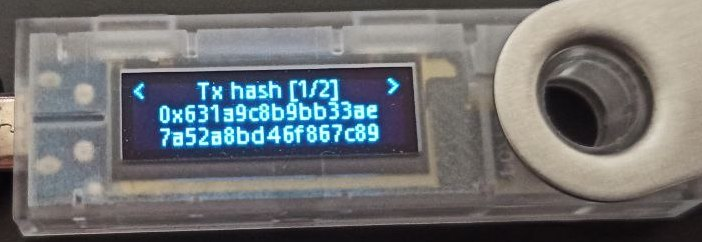

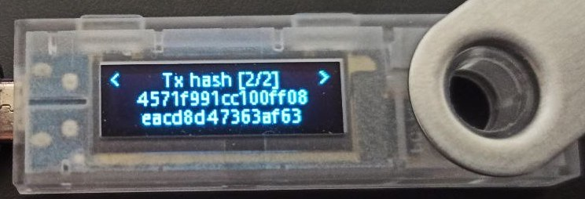

Khala genesis hash hasn't added to list of already known chains, so app print full genesis hash:

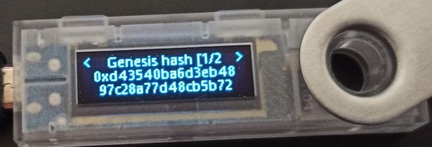

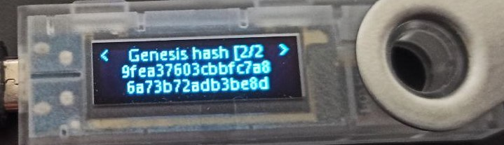

```bash
Ledger response: {
    "return_code": 36864,
    "error_message": "No errors",
    "signature": "00298f0cac6a7c503d1b05000982fb8fe3d5e129d5f320094e209fcf4419f7561fba54cc2e3d26e167833e7ddade95153cb903d2b98a2cb941f407cc5f01b4d60c"
}
Signature is valid: true

Signed tx as bytes: 0x41028400d8a1f451162e6163488001efd01ecc0f9db7494834664b34d0fd225d67f0b72d00298f0cac6a7c503d1b05000982fb8fe3d5e129d5f320094e209fcf4419f7561fba54cc2e3d26e167833e7ddade95153cb903d2b98a2cb941f407cc5f01b4d60c620004002800004c388c1b04512ee6dd3afd3355fe0498f55c57773d1f4862bdf6aa27d12e387f0700e40b5402
Signed tx as json: {
    "isSigned": true,
    "method": {
        "args": {
        "dest": {
          "Id": "42LjC8HjqVY3eqAKiFRntWFvXZieCRhqpNCgBpTzNib2G3Wo"
        },
        "value": "10,000,000,000"
        },
        "method": "transfer",
        "section": "balances"
    },
    "era": {
        "MortalEra": {
            "period": "8",
            "phase": "6"
        }
    },
    "nonce": "1",
    "signature": "0x298f0cac6a7c503d1b05000982fb8fe3d5e129d5f320094e209fcf4419f7561fba54cc2e3d26e167833e7ddade95153cb903d2b98a2cb941f407cc5f01b4d60c",
    "signer": {
      "Id": "45WqD589ELGcLgdUt4wB91iNyY4iXkmE4TRLpr576LB4NBCG"
    },
    "tip": "0"
}

Send signed tx to chain
Submitted tx hash: 0x15ac159eef5bd1a284530049bf8078e04b04145502258aaad61fbf699f70c1d8
Subscan link: https://khala.subscan.io/extrinsic/0x15ac159eef5bd1a284530049bf8078e04b04145502258aaad61fbf699f70c1d8 (please wait 1 minute to processing)
```
[Subscan](https://khala.subscan.io/extrinsic/0x15ac159eef5bd1a284530049bf8078e04b04145502258aaad61fbf699f70c1d8)
